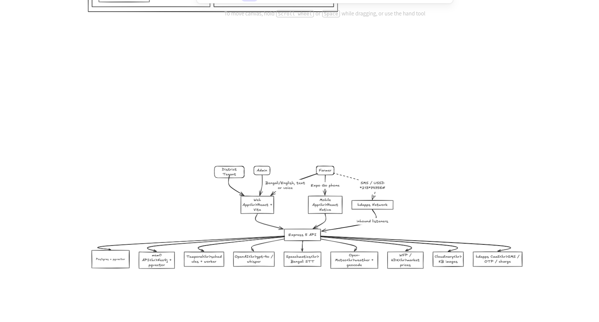
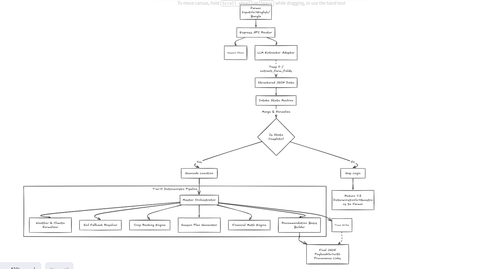
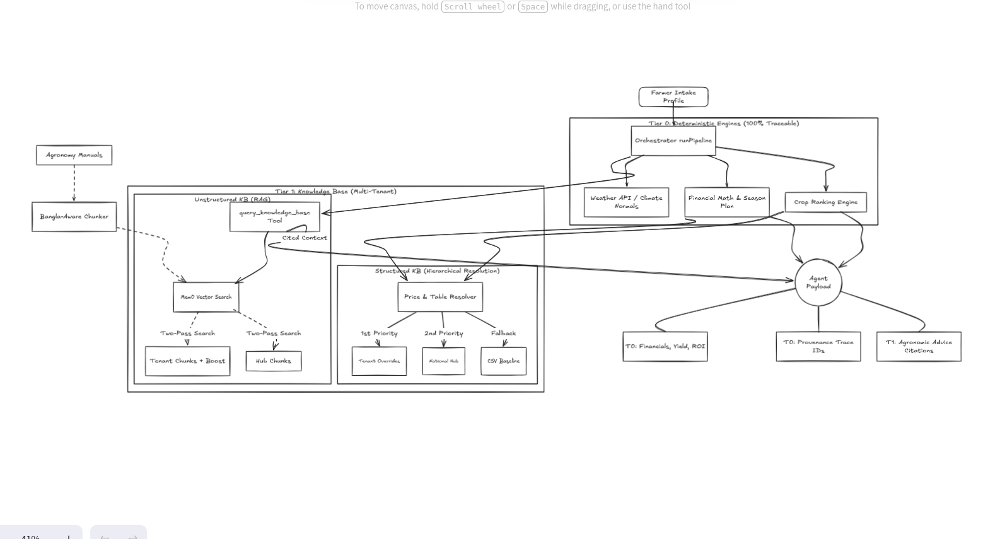
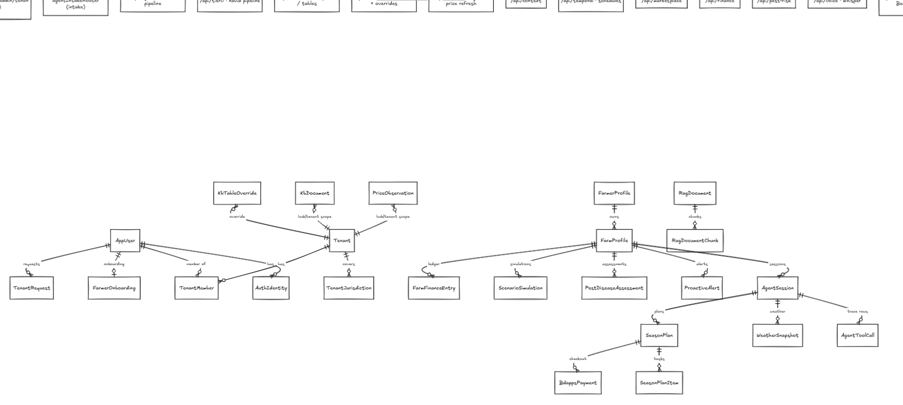
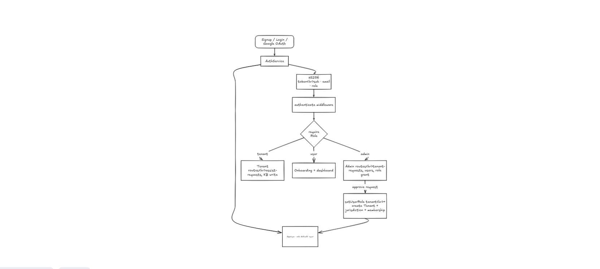
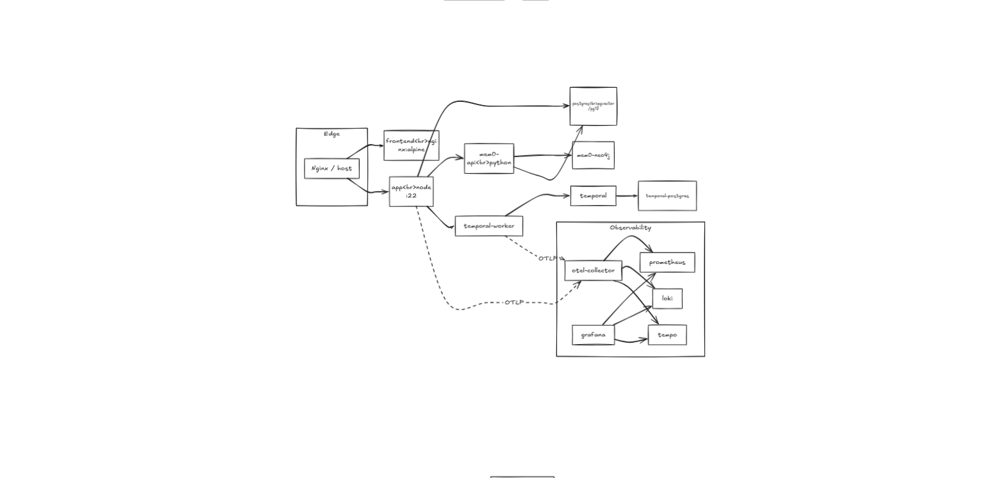

# AgriSense AI

> An autonomous agricultural advisor that takes a Bangladeshi smallholder farmer from an empty
> field to a **grounded, explained, costed, weather-aware season plan** — and keeps advising
> through harvest.

Built for the **IUT 12th ICT Fest — Agentic AI Hackathon** (bdapps, powered by Codex). The agent
holds a conversation to learn the farm, calls real external services, retrieves from a knowledge
base, runs the arithmetic, sequences a whole-season plan, and shows a trace of every step so a
judge can confirm each number came from a real call — not the model's imagination.

- **Web:** React + Vite &nbsp;•&nbsp; **Mobile:** React Native (Expo) &nbsp;•&nbsp; **API:** Express 5 (TypeScript)
- **LLM:** OpenAI gpt-4o / gpt-4.1-mini (fields + prose only, **never numbers**)
- **Data plane:** Postgres + pgvector, mem0 (Neo4j + pgvector) for RAG & memory, Temporal for scheduled proactive advice
- **Languages:** English, Bangla, and Banglish, with voice input

---

## Table of contents

- [What is real vs mock](#what-is-real-vs-mock)
- [Architecture](#architecture)
- [How we solved each tier](#how-we-solved-each-tier)
  - [Tier 0 — Core (required)](#tier-0--core-required)
  - [Tier 1 — Advanced](#tier-1--advanced)
  - [Tier 2 — Ambitious (bonus)](#tier-2--ambitious-bonus)
- [Judging-criteria map](#judging-criteria-map)
- [Running it](#running-it)

---

## What is real vs mock

The hackathon rules require this to be explicit. Nothing that feeds a number the farmer acts on is
faked; the two seeded pieces are clearly separated from their real counterparts.

| Capability | Source | Live? | Honesty |
|---|---|:--:|---|
| **Weather forecast** (16-day rain/temp) | Open-Meteo (keyless) | 🟢 live, per request | **REAL** |
| **Climate normals** (seasonal rainfall) | Open-Meteo Archive | 🟢 live (2016–2025 average, computed in code) | **REAL** — labelled a historical normal, never a forecast |
| **Geocoding** (district → lat/lon) | Open-Meteo Geocoding | 🟢 live | **REAL** |
| **Market prices** (BDT/kg by market) | WFP via HDX (monthly CSV) | 🟡 periodic bulk file | **REAL, populated** — labelled "WFP monthly", not a spot price |
| **Voice transcript** (Bengali) | Speechmatics / OpenAI Whisper | 🟢 live | **REAL** |
| **LLM extraction + narration** | OpenAI gpt-4o / gpt-4.1-mini | 🟢 live (paid) | **REAL** — extracts fields & writes prose, never invents numbers |
| **Leaf disease detection** | HuggingFace classifier → OpenAI Vision fallback | 🟢 live | **REAL** |
| **SMS / OTP / charge** | bdapps CaaS | 🟢 sandbox **or** mock (`MOCK_BDAPPS`) | **REAL sandbox / MOCK**, declared per run |
| **Agronomy tables** (FRG doses, calendar, water, varieties, soil) | Public docs (FRG-2024, BARC, BRRI, BARI, SRDI) | ⚪ static, ingested | **MANUAL / curated** |
| **Prose KB** (pest & practice advisories) | Public docs, chunked into mem0 | ⚪ static, ingested | **MANUAL / curated** |
| **Marketplace suppliers + catalog** | `seedData.ts` | 🔴 seeded, static | **MOCK / seeded** (declared) |

> **Note on prices:** the KB `PriceObservation` table = **real** WFP data and drives the agent's
> financials. The `/api/marketplace` module's price history is a **separate, seeded/mock** dataset
> used only for the supplier-intelligence page.

---

## Architecture

### 1. System context — actors, channels, integrations

Three actors (district **Tenant**, **Admin**, **Farmer**) reach the system over web, mobile, or
plain **SMS/USSD** (`*213*74756#` via the bdapps network). Everything funnels through one Express 5
API that fans out to Postgres+pgvector, the mem0 memory/RAG service, a Temporal scheduler, and the
external services (OpenAI, Speechmatics, Open-Meteo, WFP/HDX, Cloudinary, bdapps CaaS).



### 2. Tier-0 deterministic pipeline

A farmer message (English/Bangla) hits the API, an **LLM extractor adapter** (temperature 0) pulls
structured farm fields, and an **intake state machine** decides whether the profile is complete. If
fields are missing it returns 1–3 targeted questions; if complete it geocodes and runs the
**master orchestrator**, which chains the deterministic engines — weather, soil, crop ranking,
season plan, financial math, recommendation basis — and a **trace writer** into a final JSON
payload with provenance links. The LLM writes prose; **every number comes from a deterministic
engine**.



### 3. Knowledge base & RAG (Tier 0 grounding + Tier 1 multi-tenant)

Agronomy manuals are chunked by a **Bangla-aware chunker** and embedded into **mem0**. Retrieval is
a two-pass search: **tenant chunks (boosted)** override **national hub chunks**. Structured tables
resolve hierarchically — **tenant override → national hub → CSV baseline** — so a district can
correct the national default without a redeploy. Retrieved, **cited** context flows into the
deterministic engines and out to the agent payload alongside the financials and provenance trace.



### 4. Data model

Multi-tenant core (`AppUser`, `Tenant`, `TenantMember`, `AuthIdentity`, `TenantJurisdiction`) plus
the farm domain (`FarmProfile` → `SeasonPlan`/`SeasonPlanItem`, `FarmFinanceEntry`,
`ScenarioSimulation`, `PestDiseaseAssessment`, `ProactiveAlert`, `AgentSession` → `WeatherSnapshot`
& `AgentToolCall`, `BdappsPayment`) and the knowledge base (`KbDocument`, `KbTableOverride`,
`PriceObservation`, `RagDocument`/`RagDocumentChunk`).



### 5. Auth & RBAC

Signup / login / Google OAuth issues an **HS256** token (`sub`, `email`, `role`). An `authenticate`
middleware plus `requireRole` gates routes into three roles: **farmer** (onboarding + dashboard),
**tenant** (assist-requests, KB write), and **admin** (approve tenant requests, grant roles). Admin
approval creates the Tenant, its jurisdiction, and the membership.



### 6. Deployment topology

One `docker compose` stack: Nginx edge → `frontend` (nginx:alpine) and `app` (node:22) → Postgres,
`mem0-api` (Python) → `mem0-neo4j`, `temporal` + `temporal-postgres` + `temporal-worker`, and a full
**observability** stack (OpenTelemetry collector → Prometheus, Loki, Tempo, Grafana) fed over OTLP.



---

## How we solved each tier

### Tier 0 — Core (required)

The single path — *from a short conversation, produce a grounded, explained, costed season plan* —
runs end to end. Every number is produced by a deterministic TypeScript engine and shown in the
trace.

| # | Capability | How we solved it | Where |
|---|---|---|---|
| 1 | **Conversational intake** | LLM extractor (temp 0, `extract_farm_fields` tool) pulls location, farm size, soil, water, budget, target season from a vague opening message. An intake state machine detects the *specific* missing fields and asks only 1–3 targeted follow-ups instead of guessing. | `src/agent/intakeService.ts`, `extractIntakeProfile.ts`, `requiredFieldGaps.ts` · `/api/agrisense` |
| 2 | **Live weather grounding** | Real **Open-Meteo** forecast + archive normals, fetched per request by the farm's geocoded lat/lon; the returned rainfall/temperature feed ranking and the season-plan weather notes. No invented forecasts. | `src/agrisense/weatherTool.ts` |
| 3 | **Crop recommendation** | Ranks ≥3 candidate crops with suitability, water need, risk level, and a profit estimate, scored from profile + weather + KB evidence. | `src/agrisense/planningEngine.ts` (`rankCrops`, `selectCrop`) |
| 4 | **Season plan** | Dated calendar from land prep → sowing → fertilizer splits → irrigation → weed/pest checkpoints → harvest, derived from FRG/crop-calendar tables for the chosen crop. | `src/agent/seasonPlan.ts`, `planningEngine.ts` (`buildSeasonPlan`) |
| 5 | **Financial projection** | Itemized cost breakdown + expected yield, revenue, net profit, ROI, break-even. Fully inspectable and internally consistent — change an input and outputs change correctly. | `src/agrisense/planningEngine.ts` · `/api/finance` |
| 6 | **Explained reasoning** | A recommendation-basis builder attaches the exact farm inputs and retrieved data behind every recommendation ("sandy soil + vegetative stage + no rain forecast → apply urea now"). | recommendation basis in the orchestrator payload |
| 7 | **Knowledge base + RAG** | Public agronomy sources (FRG-2024, BARC crop calendars, BRRI/BARI advisories) chunked and embedded into **mem0**; a two-pass retriever returns **cited** passages that ground the crop/fertilizer/season advice. Structured tables (FRG doses, water, varieties) resolve tenant → hub → CSV. | `src/kb/`, `src/agrisense/knowledgeRetriever.ts`, `scripts/kb-ingest.ts` · `/api/kb/search` |
| 8 | **Visible agent trace** | Every tool call is persisted (`AgentToolCall`) with parameters, latency, and raw response, and surfaced in the UI trace panel — so a judge can confirm each number came from a real call. | `AgentToolCall` model, `trace` events · AgriSense trace panel |

### Tier 1 — Advanced

| Capability | How we solved it | Where |
|---|---|---|
| **Persistent memory** | The farm profile, prior sessions, and past outcomes persist in **mem0** and are rehydrated across sessions, so the farmer never repeats themselves. | `src/agrisense/memoryOutcomeService.ts`, mem0 |
| **Proactive weather-triggered advice** | A **Temporal** worker watches the forecast on a schedule and emits `ProactiveAlert`s (e.g. "heavy rain in 4 days — delay nitrogen") delivered in-app and over SMS. | `src/temporal/`, `/api/temporal` · `ProactiveAlert` |
| **Fertilizer & irrigation scheduler** | Growth-stage quantities, timing, organic alternatives, and per-task cost from the FRG tables, with rain-delay warnings. | `/api/agrisense?stage=scheduler` (fertigation) |
| **Pest & disease risk** | Predicts likely pests/diseases from crop, growth stage, and weather with preventive/treatment options and estimated cost. | `src/routes/pestRisk.ts` · `/api/pest-risk` · `PestDiseaseAssessment` |
| **Scenario simulation** | "What if rainfall drops 30%?" / "budget cut 40%?" returns a revised plan with **changed numbers**, comparing baseline vs revised. | `src/agrisense/scenarioEngine.ts` · `/api/agrisense?stage=scenario` |

### Tier 2 — Ambitious (bonus)

| Capability | How we solved it | Where |
|---|---|---|
| **Marketplace & supplier comparison** | Matches input needs to suppliers ranked by price, delivery, distance, rating (seeded catalog, clearly declared). | `src/routes/marketplace.ts` · `/api/marketplace` |
| **Market price intelligence** | **Real** WFP/HDX monthly prices → a sell-now / store / wait signal with reasoning ("trend only, not a forecast"). | `src/kb/priceStore.ts` · `/api/kb/prices/signal` |
| **Plant disease detection from images** | Farmer uploads a leaf photo → a HuggingFace plant-disease classifier, with an OpenAI Vision fallback for low-confidence/uncovered crops; result stored in `leaf_diagnoses`. | `src/vision/`, `src/routes/vision.ts` · `/api/vision` |
| **bdapps Payment Gateway** | Full bdapps **CaaS** flow in sandbox/mock: OTP-based channel activation, operator-balance charge, and receipt readback. | `src/routes/payments.ts`, `channel.ts`, bdapps listener |
| **Bengali & voice interaction** | End-to-end Bangla UI/i18n plus voice intake via **Speechmatics** (Bengali) with an OpenAI Whisper fallback. | `/api/voice`, `/api/voice/speechmatics` |

---

## Judging-criteria map

| Criterion | Pts | Where it lives |
|---|:--:|---|
| Agentic behavior | 20 | intake gap-filling, multi-step orchestrator, mem0 memory, real tool calls |
| Scope & execution | 15 | Tier-0 path runs end to end; one `docker compose up` |
| Accuracy & practicality | 20 | deterministic financial math grounded in FRG/WFP data |
| Knowledge base | 12 | mem0 RAG + hierarchical CSV tables, cited passages |
| bdapps CaaS integration | 10 | OTP → charge → receipt (`/api/payments`, `/api/channel`) |
| Explainability | 10 | recommendation basis + visible `AgentToolCall` trace |
| Technical implementation | 8 | clean external-API integration, tests, OTel observability |
| Innovation | 5 | scenario sim, proactive Temporal alerts, leaf diagnosis, marketplace |

---

## Running it

```bash
cp .env.example .env          # add OPENAI_API_KEY (+ optional Speechmatics/bdapps keys)
docker compose up -d          # app, frontend, postgres, mem0, temporal, observability

# one-time: ingest the public agronomy sources into the knowledge base
npx tsx --env-file=.env scripts/kb-ingest.ts \
  --file kb-sources/prose/frg_2024_fertilizer.md \
  --docKey barc:frg2024:fertilizer:8-crops --docType fertilizer \
  --source "BARC Fertilizer Recommendation Guide 2024"
# (repeat for the other files in kb-sources/prose/)
```

- **Web app:** http://localhost:5173
- **API:** http://localhost:3000  (health at `/health`)
- **Grafana:** http://localhost:3001  (`GRAFANA_PORT` override)

`MOCK_BDAPPS=true` runs the bdapps CaaS flow against the local simulator; unset it (and provide
bdapps credentials) to hit the real sandbox.
