# AgriSense — Architecture (Mermaid)

Visual reference for the whole app, grounded in the actual code (routes, services, stores,
workflows, Prisma models). Diagrams are grouped by tier.

> **Legend of maturity**
> - **T0 (Core, required):** conversational intake → live weather → crop ranking → season plan →
>   financials → explained reasoning → visible trace → KB+RAG.
> - **T1 (Advanced):** persistent memory, proactive weather-triggered alerts, fertilizer/irrigation
>   scheduler, pest & disease risk, scenario simulation, multi-tenant KB.
> - **T2 (Bonus):** marketplace & supplier comparison, market-price intelligence, bdapps CaaS,
>   SMS/USSD channel, Bengali + voice.
> - Two Tier-0 agent implementations coexist: **`/api/agrisense`** (teammate's, wired to the mobile
>   app + web) and **`/api/tier0`** (navid's deterministic pipeline). Both are shown where relevant.
> - *Plant-disease-from-image is not implemented; pest risk is rule-based.*

---

## 1. System context

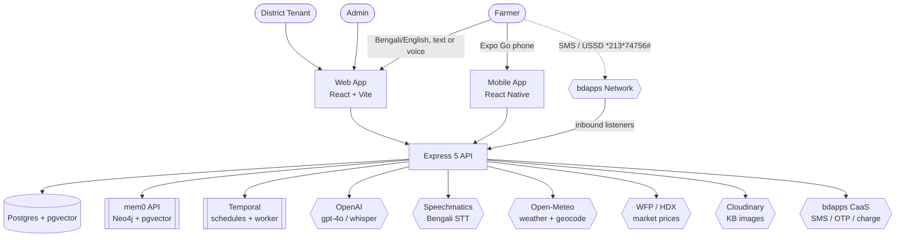
```mermaid
flowchart TD
    Farmer([Farmer]) -->|Bengali/English, text or voice| Web[Web App<br/>React + Vite]
    Farmer -->|Expo Go phone| Mobile[Mobile App<br/>React Native]
    Farmer -.->|SMS / USSD *213*74756#| BDAppsNet{{bdapps Network}}
    Tenant([District Tenant]) --> Web
    Admin([Admin]) --> Web

    Web --> API[Express 5 API]
    Mobile --> API
    BDAppsNet -->|inbound listeners| API

    API --> PG[(Postgres + pgvector)]
    API --> Mem0[[mem0 API<br/>Neo4j + pgvector]]
    API --> Temporal[[Temporal<br/>schedules + worker]]

    API --> OpenAI{{OpenAI<br/>gpt-4o / whisper}}
    API --> Speechmatics{{Speechmatics<br/>Bengali STT}}
    API --> OpenMeteo{{Open-Meteo<br/>weather + geocode}}
    API --> WFP{{WFP / HDX<br/>market prices}}
    API --> Cloudinary{{Cloudinary<br/>KB images}}
    API --> BDAppsAPI{{bdapps CaaS<br/>SMS / OTP / charge}}
```

---

## 2. Deployment / container topology

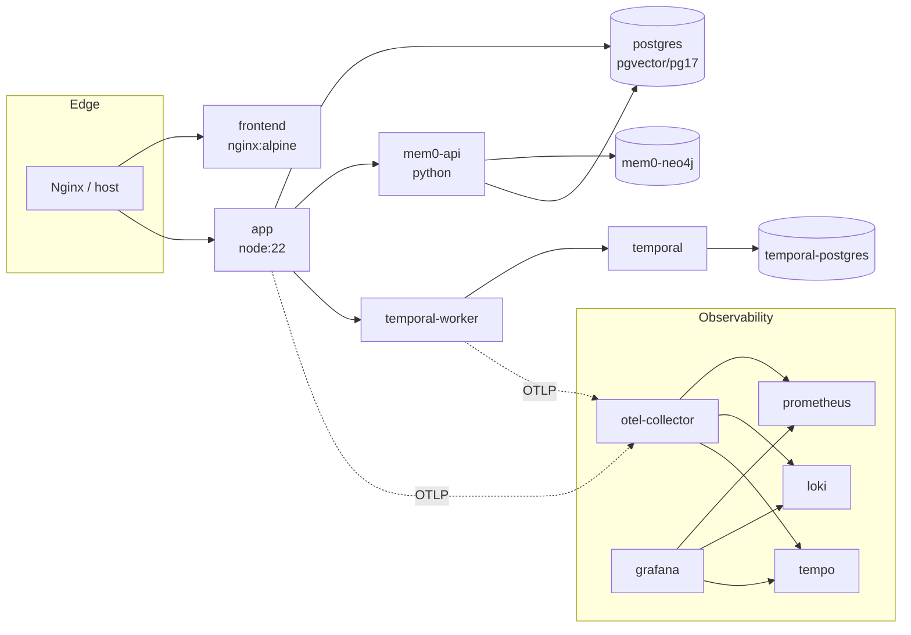
```mermaid
flowchart LR
    subgraph Edge
        Nginx[Nginx / host]
    end
    Nginx --> FE[frontend<br/>nginx:alpine]
    Nginx --> APP[app<br/>node:22]

    APP --> PGC[(postgres<br/>pgvector/pg17)]
    APP --> MEM[mem0-api<br/>python]
    MEM --> NEO[(mem0-neo4j)]
    MEM --> PGC
    APP --> TW[temporal-worker]
    TW --> TMP[temporal]
    TMP --> TPG[(temporal-postgres)]

    subgraph Observability
        OTEL[otel-collector] --> PROM[prometheus]
        OTEL --> LOKI[loki]
        OTEL --> TEMPO[tempo]
        GRAF[grafana] --> PROM & LOKI & TEMPO
    end
    APP -.OTLP.-> OTEL
    TW -.OTLP.-> OTEL
```

---

## 3. API surface (routers)

```mermaid
flowchart TD
    APP[Express app.ts] --> AUTH["/auth · authRouter"]
    APP --> USERS["/api/users · usersRouter"]
    APP --> STATS["/api/stats"]
    APP --> ONB["/api · onboardingRouter (onboarding/admin/tenant)"]
    APP --> AGENT["/api/agent · agentIntakeRouter (intake)"]
    APP --> AGRI["/api/agrisense · full pipeline"]
    APP --> TIER0["/api/tier0 · navid pipeline"]
    APP --> KB["/api/kb · search / prices / tables"]
    APP --> TEN["/api/tenants · tenant KB + overrides"]
    APP --> HUB["/api/hub · hub ingest + price refresh"]
    APP --> CTX["/api/context"]
    APP --> TEMP["/api/temporal · schedules"]
    APP --> MKT["/api/marketplace"]
    APP --> FIN["/api/finance"]
    APP --> PEST["/api/pest-risk"]
    APP --> VOICE["/api/voice · Whisper"]
    APP --> VSM["/api/voice/speechmatics · Bengali STT"]
    APP --> PAY["/api/payments · CaaS checkout"]
    APP --> CH["/api/channel · phone OTP activation"]
    APP --> BDL["/bdapps · inbound SMS/USSD listeners"]
    APP --> BDT["/api/bdapps · test triggers"]
```

---

## 4. Data model (key entities)

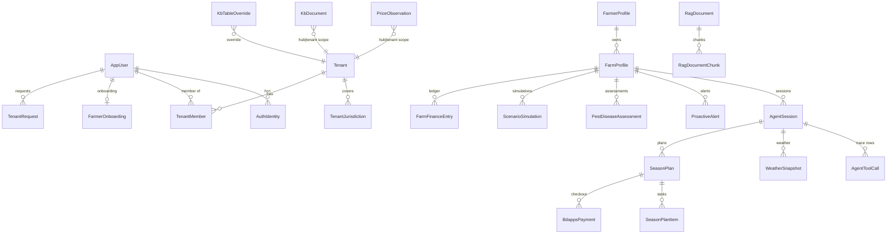
```mermaid
erDiagram
    AppUser ||--o{ AuthIdentity : has
    AppUser ||--o{ TenantMember : "member of"
    AppUser ||--o| FarmerOnboarding : "onboarding"
    AppUser ||--o{ TenantRequest : requests
    Tenant ||--o{ TenantJurisdiction : covers
    Tenant ||--o{ TenantMember : has
    FarmerProfile ||--o{ FarmProfile : owns
    FarmProfile ||--o{ AgentSession : sessions
    AgentSession ||--o{ AgentToolCall : "trace rows"
    AgentSession ||--o{ WeatherSnapshot : weather
    AgentSession ||--o{ SeasonPlan : plans
    SeasonPlan ||--o{ SeasonPlanItem : tasks
    SeasonPlan ||--o{ BdappsPayment : checkout
    FarmProfile ||--o{ ProactiveAlert : alerts
    FarmProfile ||--o{ PestDiseaseAssessment : assessments
    FarmProfile ||--o{ ScenarioSimulation : simulations
    FarmProfile ||--o{ FarmFinanceEntry : ledger
    PriceObservation }o--|| Tenant : "hub|tenant scope"
    KbDocument }o--|| Tenant : "hub|tenant scope"
    KbTableOverride }o--|| Tenant : override
    RagDocument ||--o{ RagDocumentChunk : chunks
```

---

## 5. Auth & role-based access (RBAC)

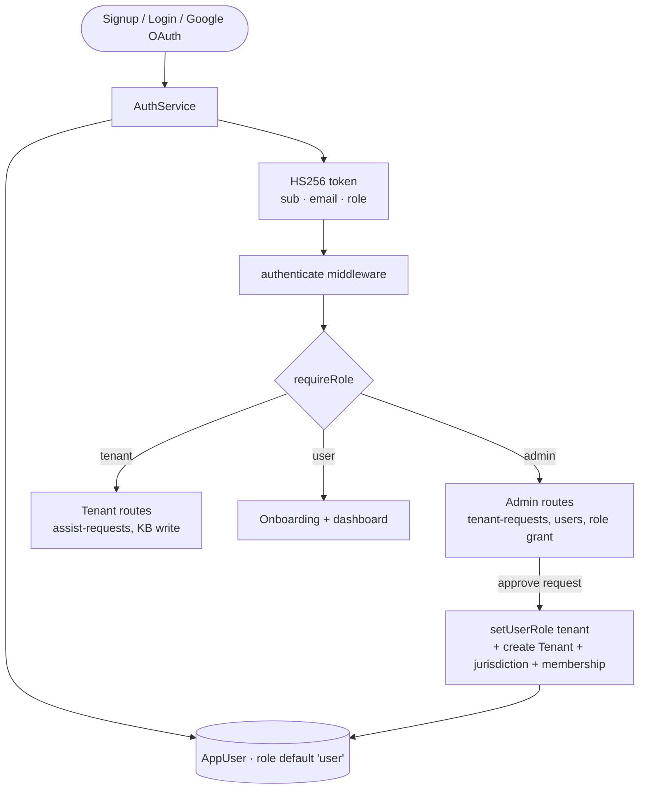
```mermaid
flowchart TD
    In([Signup / Login / Google OAuth]) --> Svc[AuthService]
    Svc --> Store[(AppUser · role default 'user')]
    Svc --> Tok[HS256 token<br/>sub · email · role]

    Tok --> Mw[authenticate middleware]
    Mw --> RR{requireRole}
    RR -->|admin| AdminAPI[Admin routes<br/>tenant-requests, users, role grant]
    RR -->|tenant| TenantAPI[Tenant routes<br/>assist-requests, KB write]
    RR -->|user| UserAPI[Onboarding + dashboard]

    AdminAPI -->|approve request| Grant[setUserRole tenant<br/>+ create Tenant + jurisdiction + membership]
    Grant --> Store
```

---

## 6. Onboarding (three paths + AI voice loop)

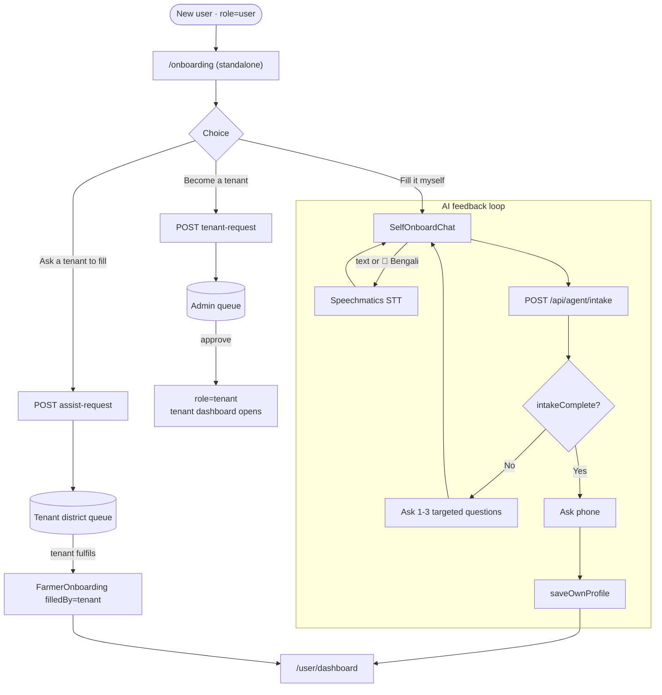
```mermaid
flowchart TD
    U([New user · role=user]) --> Land["/onboarding (standalone)"]
    Land --> Choice{Choice}

    Choice -->|Become a tenant| TR[POST tenant-request] --> AdminQ[(Admin queue)]
    AdminQ -->|approve| BecomeTenant[role=tenant<br/>tenant dashboard opens]

    Choice -->|Ask a tenant to fill| AR[POST assist-request] --> TQ[(Tenant district queue)]
    TQ -->|tenant fulfils| Saved1[FarmerOnboarding filledBy=tenant]

    Choice -->|Fill it myself| Chat[SelfOnboardChat]
    subgraph "AI feedback loop"
        Chat -->|text or 🎤 Bengali| STT[Speechmatics STT]
        STT --> Chat
        Chat --> Intake[POST /api/agent/intake]
        Intake --> Gap{intakeComplete?}
        Gap -- No --> Ask[Ask 1-3 targeted questions] --> Chat
        Gap -- Yes --> Phone[Ask phone] --> Save[saveOwnProfile]
    end
    Save --> Dash["/user/dashboard"]
    Saved1 --> Dash
```

---

## 7. Tier 0 — Conversational intake state machine

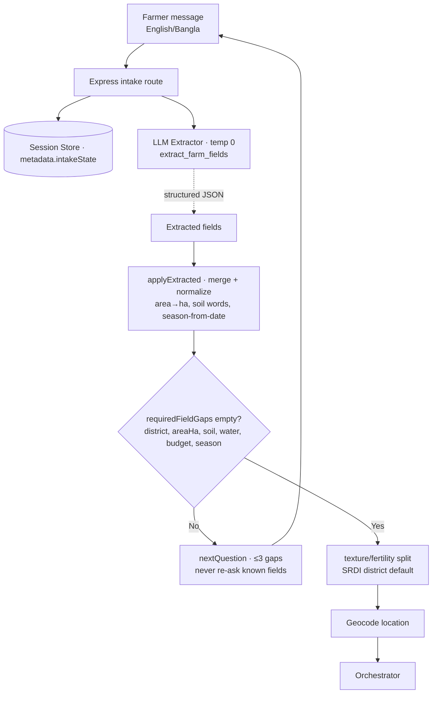
```mermaid
flowchart TD
    A[Farmer message<br/>English/Bangla] --> B[Express intake route]
    B --> C[(Session Store · metadata.intakeState)]
    B --> D[LLM Extractor · temp 0<br/>extract_farm_fields]
    D -.->|structured JSON| E[Extracted fields]
    E --> F[applyExtracted · merge + normalize<br/>area→ha, soil words, season-from-date]
    F --> G{requiredFieldGaps empty?<br/>district, areaHa, soil, water, budget, season}
    G -- No --> H[nextQuestion · ≤3 gaps<br/>never re-ask known fields] --> A
    G -- Yes --> I[texture/fertility split<br/>SRDI district default]
    I --> J[Geocode location] --> K[Orchestrator]
```

---

## 8. Tier 0 — Deterministic orchestrator pipeline

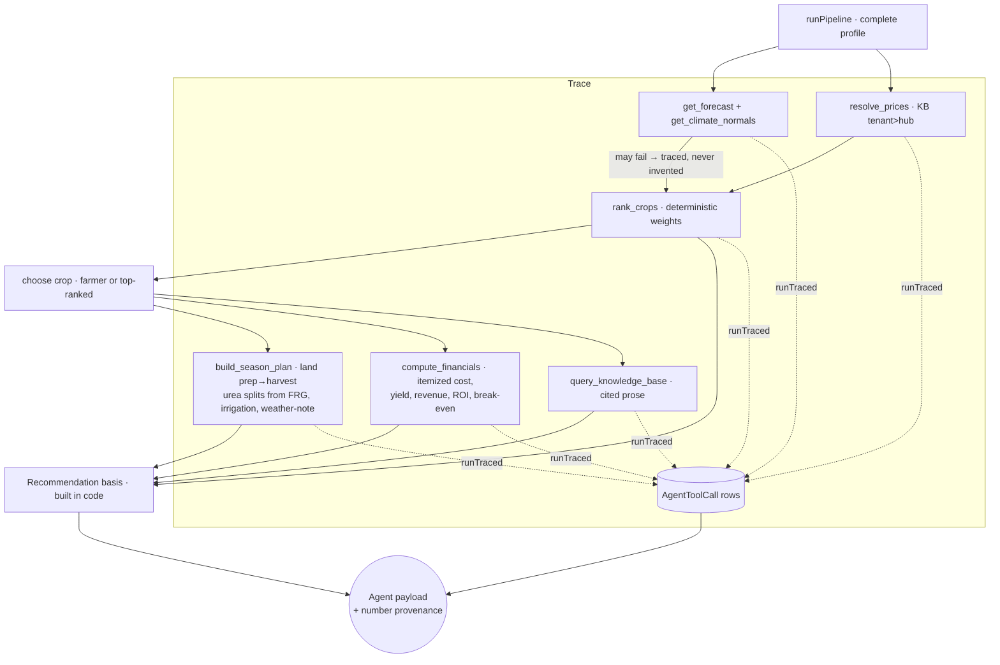
```mermaid
flowchart TD
    K[runPipeline · complete profile] --> W[get_forecast + get_climate_normals]
    W -->|may fail → traced, never invented| N
    K --> RP[resolve_prices · KB tenant>hub]
    RP --> N[rank_crops · deterministic weights]
    N --> CH[choose crop · farmer or top-ranked]
    CH --> SP[build_season_plan · land prep→harvest<br/>urea splits from FRG, irrigation, weather-note]
    CH --> FIN[compute_financials · itemized cost,<br/>yield, revenue, ROI, break-even]
    CH --> KBq[query_knowledge_base · cited prose]
    N & SP & FIN & KBq --> Basis[Recommendation basis · built in code]
    Basis --> Out((Agent payload<br/>+ number provenance))

    subgraph Trace
        W & RP & N & SP & FIN & KBq -. runTraced .-> TR[(AgentToolCall rows)]
    end
    TR --> Out
```

---

## 9. Tier 0 — Trace & provenance

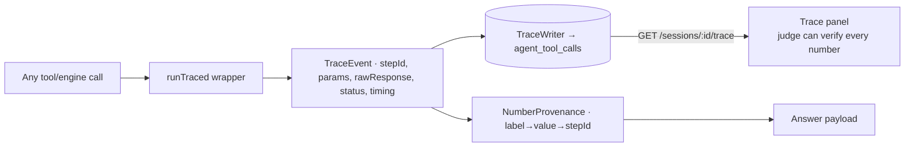
```mermaid
flowchart LR
    Tool[Any tool/engine call] --> RT[runTraced wrapper]
    RT --> Ev[TraceEvent · stepId, params, rawResponse, status, timing]
    Ev --> W[(TraceWriter → agent_tool_calls)]
    Ev --> Num[NumberProvenance · label→value→stepId]
    Num --> Payload[Answer payload]
    W -->|GET /sessions/:id/trace| Panel[Trace panel<br/>judge can verify every number]
```

---

## 10. Tier 1 — Multi-tenant Knowledge Base

```mermaid
flowchart TD
    Q[Farmer in district D] --> Resolve[resolveTenantForDistrict → tenant | hub]

    subgraph "Structured KB (hierarchical resolution)"
        Resolve --> SR[resolvePrice / resolveTable]
        SR -->|1| T[(Tenant overrides · Postgres)]
        SR -->|2| H[(National hub · WFP + FRG)]
        SR -->|3| CSV[(CSV baseline)]
        SR --> Prov1[+ provenance · source, date, basis]
    end

    subgraph "Unstructured KB (RAG)"
        Resolve --> SK[searchKB · two-pass]
        SK -->|scope=tenant +boost| TV[Tenant chunks]
        SK -->|scope=hub| HV[Hub chunks]
        TV & HV --> Merge[merge · docKey override<br/>drop mock/unverified]
        Merge --> Cite["[KB:source p.N] (+ local tenant)<br/>+ image + link"]
    end
    Prov1 & Cite --> Agent[Agent answer]
```

---

## 11. Tier 1 — KB ingestion pipeline

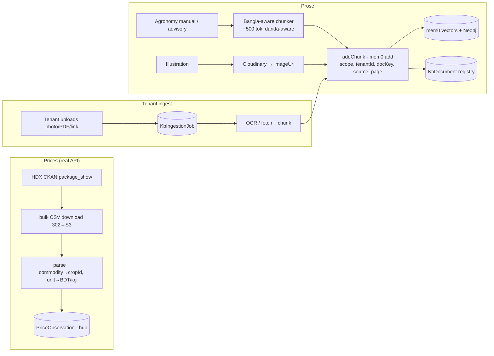
```mermaid
flowchart LR
    subgraph Prose
        Doc[Agronomy manual / advisory] --> Chunk[Bangla-aware chunker<br/>~500 tok, danda-aware]
        Img[Illustration] --> Cld[Cloudinary → imageUrl]
        Chunk & Cld --> Add[addChunk · mem0.add<br/>scope, tenantId, docKey, source, page]
        Add --> M0[(mem0 vectors + Neo4j)]
        Add --> Reg[(KbDocument registry)]
    end
    subgraph "Prices (real API)"
        CKAN[HDX CKAN package_show] --> DL[bulk CSV download 302→S3]
        DL --> Parse[parse · commodity→cropId, unit→BDT/kg]
        Parse --> Up[(PriceObservation · hub)]
    end
    subgraph "Tenant ingest"
        Ten[Tenant uploads photo/PDF/link] --> Job[(KbIngestionJob)]
        Job --> Worker[OCR / fetch + chunk] --> Add
    end
```

---

## 12. Tier 1 — Persistent memory (cross-session)

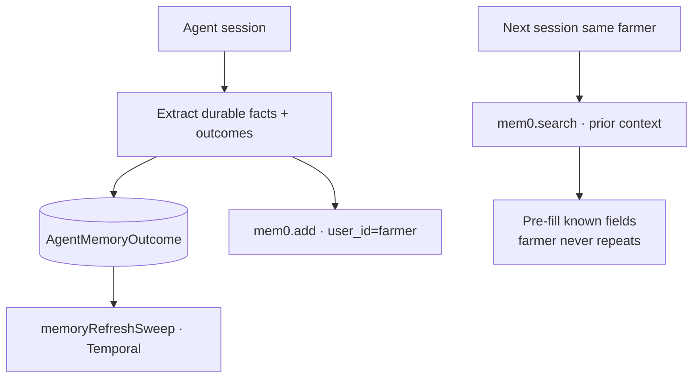
```mermaid
flowchart TD
    Sess[Agent session] --> Extract[Extract durable facts + outcomes]
    Extract --> MO[(AgentMemoryOutcome)]
    Extract --> Mem[mem0.add · user_id=farmer]
    New[Next session same farmer] --> Recall[mem0.search · prior context]
    Recall --> Pre[Pre-fill known fields<br/>farmer never repeats]
    MO --> Refresh[memoryRefreshSweep · Temporal]
```

---

## 13. Tier 1 — Proactive weather-triggered alerts (Temporal)

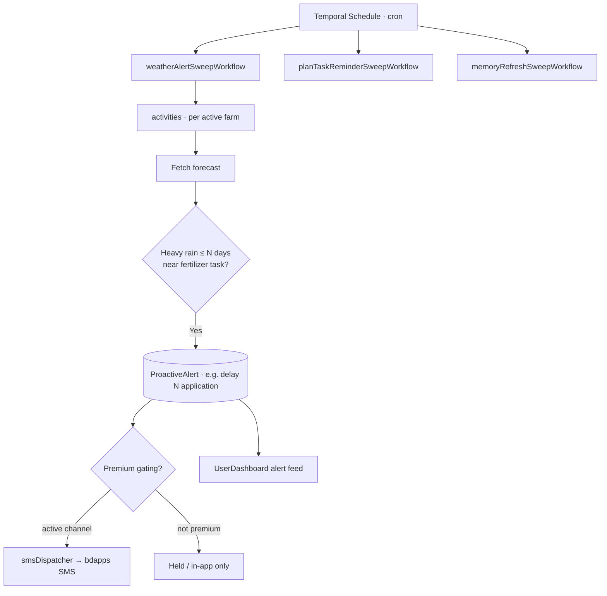
```mermaid
flowchart TD
    Sched[Temporal Schedule · cron] --> WF1[weatherAlertSweepWorkflow]
    Sched --> WF2[planTaskReminderSweepWorkflow]
    Sched --> WF3[memoryRefreshSweepWorkflow]

    WF1 --> Act[activities · per active farm]
    Act --> Fc[Fetch forecast]
    Fc --> Rule{Heavy rain ≤ N days<br/>near fertilizer task?}
    Rule -- Yes --> Alert[(ProactiveAlert · e.g. delay N application)]
    Alert --> Prem{Premium gating?}
    Prem -->|active channel| SMS[smsDispatcher → bdapps SMS]
    Prem -->|not premium| Skip[Held / in-app only]
    Alert --> Feed[UserDashboard alert feed]
```

---

## 14. Tier 1 — Fertilizer & irrigation scheduler (season plan)

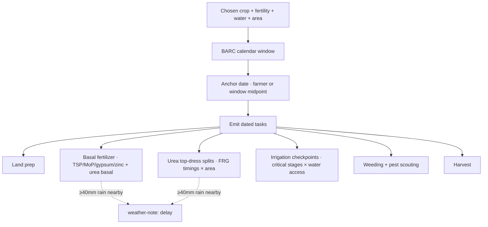
```mermaid
flowchart TD
    Crop[Chosen crop + fertility + water + area] --> Cal[BARC calendar window]
    Cal --> Anchor[Anchor date · farmer or window midpoint]
    Anchor --> Tasks[Emit dated tasks]
    Tasks --> LP[Land prep]
    Tasks --> Basal[Basal fertilizer · TSP/MoP/gypsum/zinc + urea basal]
    Tasks --> Split[Urea top-dress splits · FRG timings × area]
    Tasks --> Irr[Irrigation checkpoints · critical stages × water access]
    Tasks --> Weed[Weeding + pest scouting]
    Tasks --> Harv[Harvest]
    Basal & Split -.->|≥40mm rain nearby| Note[weather-note: delay]
```

---

## 15. Tier 1 — Pest & disease risk

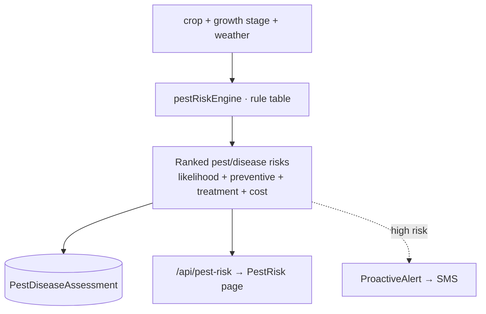
```mermaid
flowchart TD
    In[crop + growth stage + weather] --> Eng[pestRiskEngine · rule table]
    Eng --> Risk[Ranked pest/disease risks<br/>likelihood + preventive + treatment + cost]
    Risk --> Store[(PestDiseaseAssessment)]
    Risk --> UI["/api/pest-risk → PestRisk page"]
    Risk -.->|high risk| Alert[ProactiveAlert → SMS]
```

---

## 16. Tier 1 — Scenario simulation

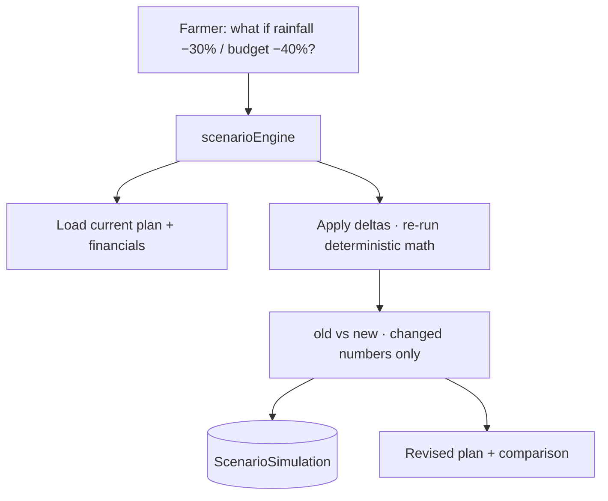
```mermaid
flowchart TD
    Ask["Farmer: what if rainfall −30% / budget −40%?"] --> SE[scenarioEngine]
    SE --> Base[Load current plan + financials]
    SE --> Apply[Apply deltas · re-run deterministic math]
    Apply --> Diff[old vs new · changed numbers only]
    Diff --> Save[(ScenarioSimulation)]
    Diff --> Out[Revised plan + comparison]
```

---

## 17. Tier 2 — Marketplace & supplier comparison

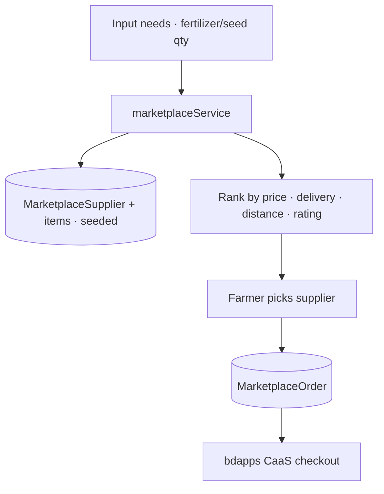
```mermaid
flowchart TD
    Need[Input needs · fertilizer/seed qty] --> MS[marketplaceService]
    MS --> Sup[(MarketplaceSupplier + items · seeded)]
    MS --> Rank[Rank by price · delivery · distance · rating]
    Rank --> Pick[Farmer picks supplier]
    Pick --> Order[(MarketplaceOrder)]
    Order --> Pay[bdapps CaaS checkout]
```

---

## 18. Tier 2 — Market-price intelligence

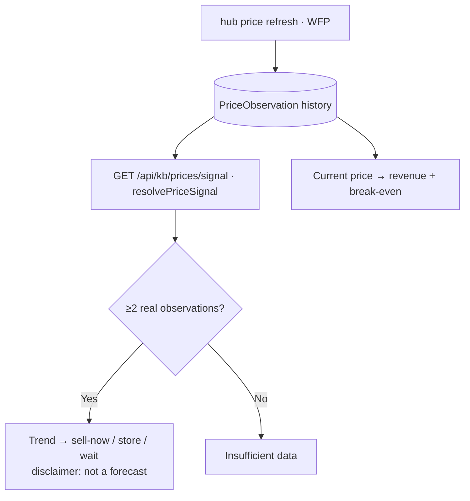
```mermaid
flowchart TD
    Refresh[hub price refresh · WFP] --> Obs[(PriceObservation history)]
    Obs --> Signal[GET /api/kb/prices/signal · resolvePriceSignal]
    Signal --> Trend{≥2 real observations?}
    Trend -- Yes --> Rec[Trend → sell-now / store / wait<br/>disclaimer: not a forecast]
    Trend -- No --> NA[Insufficient data]
    Obs --> Cur[Current price → revenue + break-even]
```

---

## 19. Tier 2 — bdapps CaaS checkout (payment)

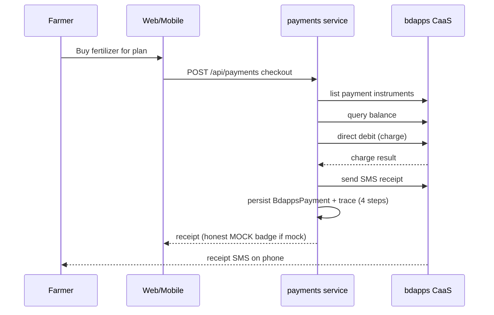
```mermaid
sequenceDiagram
    participant F as Farmer
    participant W as Web/Mobile
    participant P as payments service
    participant B as bdapps CaaS
    F->>W: Buy fertilizer for plan
    W->>P: POST /api/payments checkout
    P->>B: list payment instruments
    P->>B: query balance
    P->>B: direct debit (charge)
    B-->>P: charge result
    P->>B: send SMS receipt
    P->>P: persist BdappsPayment + trace (4 steps)
    P-->>W: receipt (honest MOCK badge if mock)
    B-->>F: receipt SMS on phone
```

---

## 20. Tier 2 — bdapps SMS / USSD / phone channel

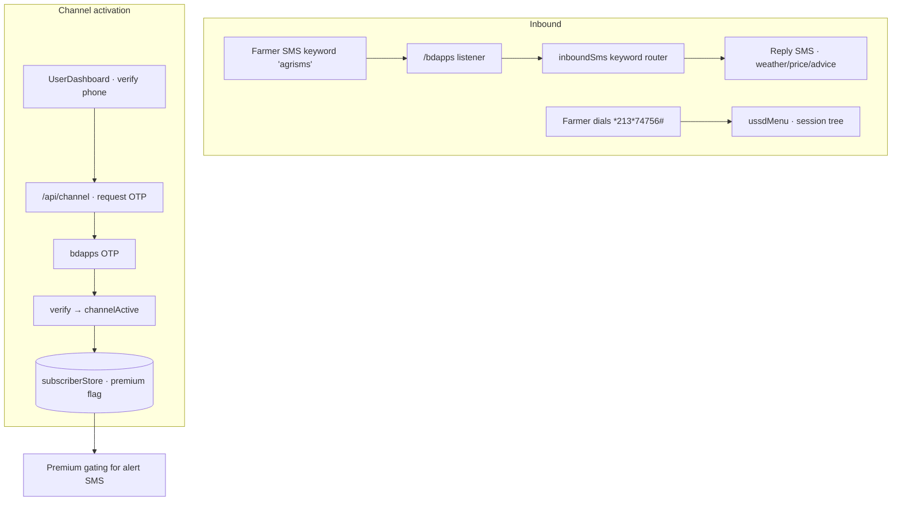
```mermaid
flowchart TD
    subgraph Inbound
        SMSin[Farmer SMS keyword 'agrisms'] --> L1["/bdapps listener"]
        L1 --> Router[inboundSms keyword router]
        Router --> Reply[Reply SMS · weather/price/advice]
        USSD["Farmer dials *213*74756#"] --> Menu[ussdMenu · session tree]
    end
    subgraph "Channel activation"
        Verify[UserDashboard · verify phone] --> OTP["/api/channel · request OTP"]
        OTP --> B[bdapps OTP]
        B --> Conf[verify → channelActive]
        Conf --> Sub[(subscriberStore · premium flag)]
    end
    Sub --> Gate[Premium gating for alert SMS]
```

---

## 21. Tier 2 — Bengali + voice input

```mermaid
flowchart TD
    Rec[MediaRecorder · audio/webm] --> Which{Provider}
    Which -->|onboarding, Bengali| SM["/api/voice/speechmatics"]
    Which -->|general intake| WH["/api/voice · OpenAI Whisper"]
    SM --> Batch[Speechmatics batch<br/>create job→poll→transcript txt · lang=bn]
    WH --> Auto[Whisper · auto-detect bn/banglish/en]
    Batch & Auto --> Txt[Transcript]
    Txt --> LangDetect[detectInputLanguage · bn / banglish / en]
    LangDetect --> Chat[Fill intake input → agent loop]
```

---

## 22. Frontend routing & role dashboards

```mermaid
flowchart TD
    Root["/"] --> Land[DashboardLanding · by role]
    Land -->|admin| AdminShell
    Land -->|tenant| TenantShell
    Land -->|user| UserShell

    subgraph "Shared AppLayout (sidebar + header)"
        AdminShell[Admin panel<br/>dashboard, users, KB, marketplace, pest, finance, bdapps]
        TenantShell[Tenant dashboard<br/>KB search + upload, assist queue]
        UserShell[Farmer dashboard<br/>sidebar tabs → sections]
    end

    UserShell --> Home[হোম]
    UserShell --> Wthr[আবহাওয়া]
    UserShell --> Crops[ফসল]
    UserShell --> Plan[পরিকল্পনা · Bengali calendar]
    UserShell --> Money[লাভ-খরচ]
    UserShell --> Why[কেন · provenance]
    UserShell --> Prof[আমার তথ্য · edit]
    RoleGuard[RoleRoute guards] -.-> AdminShell & TenantShell & UserShell
```

---

## 23. End-to-end farmer journey

```mermaid
sequenceDiagram
    autonumber
    participant F as Farmer
    participant O as Onboarding (AI + voice)
    participant A as Agent pipeline
    participant KB as KB (tenant+hub)
    participant EXT as Weather/Prices
    participant T as Temporal
    F->>O: Speak farm details (Bengali)
    O->>A: intake loop until complete → save profile
    F->>A: "best crop for me?"
    A->>EXT: forecast + climate normals
    A->>KB: resolve prices + retrieve agronomy (cited)
    A->>A: rank crops → season plan → financials
    A-->>F: recommendation + plan + ROI + citations + trace
    T->>F: (later) proactive SMS: heavy rain, delay urea
    F->>A: "what if budget −40%?" → scenario diff
    F->>A: buy inputs → bdapps CaaS → receipt SMS
```

---

## 24. Request lifecycle (middleware)

```mermaid
flowchart LR
    Req[HTTP request] --> Obs[observability middleware · OTLP span]
    Obs --> JSON[express.json]
    JSON --> Auth[authenticate · bearer]
    Auth --> Role[requireRole]
    Role --> Handler[Route handler]
    Handler --> Store[(Postgres / mem0 / external)]
    Handler --> Err{error?}
    Err -- yes --> EH[errorHandler]
    Err -- no --> Res[JSON response]
    Res --> Log[finish log · method/status/ms]
```
