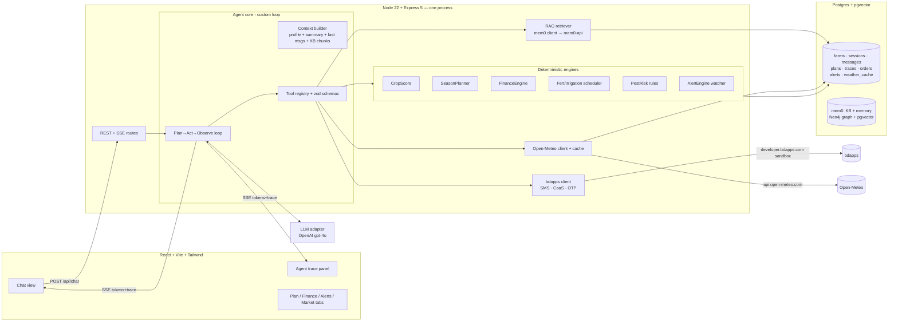

# ARCHITECTURE — AgriSense AI

> **Owner:** Member A (agent core) is the arbiter of this doc; changes to §7 contracts follow RULES.md §3.4.
> **Last updated:** 2026-07-24 ~10:40 (H+1.6)

---

## 1. Design principles

1. **The LLM never does arithmetic.** All numbers (scores, doses, dates, money) come from
   deterministic TypeScript engines the LLM calls as tools. The LLM orchestrates, asks,
   and explains. This wins "Accuracy & practicality" (20 pts) and makes math inspectable.
2. **Everything the agent does is a trace event.** No hidden calls. The trace is a product
   feature (Tier-0 #8), not a log.
3. **Few moving parts.** Node backend + Postgres/pgvector + the mem0 stack (mem0-api + Neo4j),
   all via `docker-compose up`. mem0 owns embeddings, vector search, and graph memory so the app
   never runs its own embedding model.
4. **Every risky dependency has a fallback behind a flag.** LLM provider chain, weather cache,
   `MOCK_BDAPPS`. Demo never dies on stage.
5. **Contract-first collaboration.** All cross-member boundaries are typed in `shared/types.ts`.
   Members build against contracts, not against each other's WIP.

## 2. System diagram



## 3. Repo layout (the ownership map — see RULES.md §3.3)

```
<TeamName>AgriSense/
├── docs/                  # these six planning docs, copied in at repo creation
├── shared/
│   └── types.ts           # ALL cross-boundary contracts (owner: A; change protocol in RULES)
├── server/
│   ├── index.ts           # bootstrap: express, routes, SSE, cron watcher
│   ├── config.ts          # env parsing, feature flags (all FLAG_* and MOCK_* here)
│   ├── db/                # schema.sql, db.ts (better-sqlite3 init + DAOs)      [owner C]
│   ├── agent/             # loop.ts, context.ts, prompts.ts, toolRegistry.ts    [owner A]
│   ├── llm/               # provider.ts (interface), openai.ts (agent chat only) [A]
│   ├── tools/             # one file per tool; thin wrappers binding engines/clients to schemas [A wires, B/C implement behind]
│   ├── engines/           # cropScore.ts, seasonPlanner.ts, finance.ts, fertilizer.ts, pest.ts, alerts.ts  [owner B]
│   ├── rag/               # mem0Client.ts (mem0-api HTTP), mem0Store.ts (pgvector), ingest.ts (CLI) [owner B]
│   ├── integrations/
│   │   ├── openMeteo.ts   # geocode + forecast + SQLite cache                   [owner B]
│   │   └── bdapps/        # client.ts, sms.ts, caas.ts, otp.ts, listeners.ts, mock.ts [owner C]
│   ├── routes/            # chat.ts, farms.ts, plans.ts, orders.ts, alerts.ts, trace.ts [owner C]
│   └── seed/              # suppliers.json, marketPrices.json (dated, declared mock)     [owner B]
├── web/                   # Vite React app                                       [owner C]
│   └── src/{api,components,pages,state}/
├── kb-sources/            # raw downloaded public docs + SOURCES.md (url, date, license)  [owner B]
├── scripts/               # ingest-kb.ts, seed-demo-farm.ts, smoke-e2e.ts
├── .env.example           # every var documented; real .env is gitignored
└── README.md              # submission doc: setup, tiers, real-vs-mock, tools used [owner C, all review]
```

## 4. The agent core (Member A) — harness we own

### 4.1 Loop (plan → act → observe, bounded)

```
handleTurn(sessionId, userMsg):
  ctx  = buildContext(sessionId)                  # §4.2
  gaps = requiredFieldGaps(ctx.profile)           # deterministic, not LLM
  loop up to MAX_STEPS (8):
      resp = llm.chat(ctx, tools)                 # function-calling
      if resp.toolCalls:
          for call in resp.toolCalls:             # parallel-safe calls batched
              validate(call.args, zodSchema)      # reject → error back to model, not crash
              result = execute(call)              # engines/RAG/APIs
              emit TraceEvent{tool,args,raw,ms}   # SSE + SQLite
              append toolResult to ctx
      else:
          final answer → stream tokens via SSE
          postTurn: update rolling summary, persist profile deltas, run AlertEngine check
          break
```

- **Step budget + dedupe:** identical tool call in same turn returns cached result; hard stop
  at MAX_STEPS with a graceful "here's what I have so far".
- **Planning visibility:** system prompt requires the model to emit a one-line step plan before
  the first tool call of a multi-step task; the harness surfaces it as a `plan` trace event
  (judges see A2 explicitly).
- **Gap-filling:** if `gaps` non-empty and the user intent needs those fields, the prompt
  instructs: ask ONLY for `gaps` (A3). Known fields are pinned in context so it never re-asks (A4).

### 4.2 Context engineering (what goes into every LLM call)

| Slot | Source | Budget |
|---|---|---|
| System prompt | persona, rules, explanation format, citation rules, tool guidance | fixed |
| Farm profile | SQLite `farms` row, always pinned as compact JSON | ~200 tok |
| Rolling summary | per-session summary updated after each turn (LLM-generated, stored) | ~300 tok |
| Last N messages | verbatim recent window (N≈8) | bounded |
| Tool results this turn | raw JSON, trimmed to relevant fields | bounded |
| KB chunks | only via `query_knowledge_base` tool results, with `[KB:doc§sec]` ids | top-5 |

Cross-session memory (T1-1): on session start, load farm by phone/farm-id → inject profile +
last plan status + previous summary. Greeting template proves it in the demo.

### 4.3 Tool registry (zod-validated, all emit trace events)

| Tool | Backs onto | Owner of implementation |
|---|---|---|
| `geocode_location(name)` | Open-Meteo geocoding | B |
| `get_weather(lat,lon,days)` | Open-Meteo forecast + cache | B |
| `query_knowledge_base(query, cropFilter?)` | mem0 `search` (semantic + graph) | B |
| `rank_crops(profile, weatherSummary)` | CropScore engine | B |
| `build_season_plan(crop, sowDate, profile)` | SeasonPlanner | B |
| `compute_financials(crop, area, inputs…)` | FinanceEngine (pure) | B |
| `simulate_scenario(planId, deltas)` | FinanceEngine + planner re-run | B |
| `get_fertilizer_schedule(crop, area, soil)` | Fert/Irrigation scheduler | B |
| `assess_pest_risk(crop, stage, weather)` | PestRisk rules | B |
| `get_market_prices(crop)` | seeded DAM snapshot | B |
| `list_suppliers(item, district)` | seeded catalog | B |
| `save_farm_profile(patch)` / `get_farm_profile()` | SQLite DAO | C |
| `create_order(items)` → `checkout_order(orderId)` | bdapps CaaS flow | C |
| `send_sms(msg)` | bdapps SMS | C |

Rule: tools return **structured JSON with units** (`{ value: 45, unit: "kg/acre" }`);
prompts forbid the model from inventing any number not present in a tool result.

## 5. Deterministic engines (Member B) — the accuracy moat

All engines are **pure functions** over typed inputs, unit-tested with vitest (these tests are
the "working tests where they matter" for the 8-pt technical row).

- **CropScore:** for each candidate crop (from KB crop tables): suitability = weighted
  soil-match × season-match × water-feasibility × temperature-fit (forecast vs crop range)
  × budget-feasibility. Outputs per crop: score 0–100, water need class, risk level + reason,
  rough profit/acre (delegates to FinanceEngine defaults). Returns top ≥3 with the factor
  breakdown so the LLM can explain *why* (A5).
- **SeasonPlanner:** stage table per crop (KB: land prep, sowing window, vegetative,
  flowering, maturity, harvest) → dated tasks from chosen sow date; fertilizer splits mapped
  to stages; irrigation + weed/pest checkpoints inserted. Pure date arithmetic.
- **FinanceEngine:** itemized costs (seed, fertilizer = BARC dose × area × unit price, irrigation,
  labor, pesticide, misc) → total cost, expected yield × farm-gate price = revenue, net, ROI,
  break-even price & yield. One function `project(inputs) → FinancialProjection`; scenario
  simulation = same function with patched inputs, so consistency is free.
- **Fert/Irrigation scheduler (T1-3):** BARC dose tables (urea/TSP/MoP split by stage) ×
  area; irrigation events adjusted: skip/delay if forecast rain ≥ threshold in window.
- **PestRisk (T1-4):** rule rows `{crop, stage, condition(weather) → pest, severity, prevention, treatment, cost}` sourced from KB docs.
- **AlertEngine (T1-2):** on interval (and on a dev "simulate" trigger): re-fetch forecast,
  evaluate rules against pending plan tasks (e.g. N-topdress within 3 days + rain ≥ 20mm
  forecast → advise delay), write alert + optional bdapps SMS. Every alert stores its rule id
  + forecast values → explainable.

## 6. External services & the no-paid-API constraint

| Need | Choice | Notes |
|---|---|---|
| LLM (agent) | **OpenAI `gpt-4o`** (funded `OPENAI_API_KEY`) | function calling + streaming + vision (enables T2-4). `gpt-4o-mini` as a cheap swap via `OPENAI_CHAT_MODEL`. Single provider — no key rotation. |
| RAG / vectors / memory | **mem0** (self-hosted `mem0-api` + Neo4j graph + pgvector) | already set up in `docker-compose.yml` + `deploy/mem0/`. App integrates via `src/rag/mem0Client.ts` (`add` to ingest, `search` to retrieve). mem0 embeds with OpenAI `text-embedding-3-small` (1536-dim, matches `vector(1536)`/`RAG_EMBEDDING_DIMENSIONS`) internally — the app never calls the embeddings API directly. |
| Weather | **Open-Meteo** forecast + geocoding | free, keyless, 16-day daily + hourly; every response cached in `weather_cache` (resilience + demo replay). |
| SMS / payment | **bdapps sandbox** (`developer.bdapps.com`) | credentials from provisioning (see BDApps-Service-Setup). `MOCK_BDAPPS=1` for dev/offline only — declared in README. |
| Market prices | Seeded JSON from public DAM bulletins (dated) | declared seeded; optional live scrape is a flagged stretch, never on the demo path. |

**LLM adapter interface** (in `src/llm/provider.ts`):
`chat(messages, tools, opts) → {text?, toolCalls?, usage}` with streaming callback, plus
`embed(texts) → number[][]` for the RAG store. The OpenAI implementation translates tool schemas
and handles retry/backoff on 429/5xx. Single provider, so no rotation/failover layer; nothing
outside `src/llm/` knows which model is live.

## 7. Data & contracts

App state (Postgres via Prisma, `prisma/schema.prisma`): `farms`, `sessions`, `messages`,
`summaries`, `plans`, `plan_tasks`, `trace_events` (`agent_tool_calls`), `weather_cache`
(`weather_snapshots`), `market_prices`, `suppliers`, `orders`, `payments`, `alerts`.
**KB chunks + conversational memory + all vectors live in mem0** (Neo4j graph + pgvector),
reached through `src/rag/mem0Client.ts` — not app-owned SQL tables.

Core shared types (full field lists in DESIGN.md §6; file `shared/types.ts` is the single
source of truth): `FarmProfile`, `WeatherDaily`, `CropRecommendation`, `SeasonPlan`,
`PlanTask`, `FinancialProjection`, `ScenarioResult`, `TraceEvent`, `Alert`, `Order`,
`PaymentResult`, `KbChunk`, `ChatEvent` (SSE union).

**API surface (server/routes, owner C):**

| Route | Purpose |
|---|---|
| `POST /api/chat` → SSE | body `{sessionId?, farmId?, message}`; streams `ChatEvent`: `token`, `plan`, `trace`, `alert`, `done` |
| `GET /api/farms/:id` / `GET /api/farms/:id/plan` | profile + current plan for tabs |
| `GET /api/sessions/:id/trace` | full persisted trace (judge inspection) |
| `POST /api/orders/:id/checkout` | runs CaaS flow, returns `PaymentResult` |
| `POST /api/dev/simulate-forecast` | dev-only: inject forecast delta to demo T1-2 (declared as simulation) |
| `POST /bdapps/sms` · `/bdapps/ussd` · `/bdapps/subscription` | bdapps inbound listeners (reply `S1000`) |

## 8. Failure & demo-resilience matrix

| Failure | Mitigation |
|---|---|
| LLM 429/outage | retry/backoff on the OpenAI call → user-visible "retrying" state; short answers cached per session; `gpt-4o-mini` swap via env if `gpt-4o` is rate-limited |
| Open-Meteo down / venue wifi flake | last cached forecast for that lat/lon served with `stale: true` flag; agent says "using this morning's forecast, fetched HH:MM" (still real data, honestly labeled) |
| bdapps E1303 (IP not whitelisted) | re-check venue public IP at every network change; documented fix; `MOCK_BDAPPS` only if sandbox is down during dev — never silently in demo |
| bdapps E1326 (low balance) | demo script uses small amounts (৳5–20); low-balance path is itself a demoable branch ("insufficient balance" advice) |
| SQLite corruption / bad state mid-demo | `scripts/seed-demo-farm.ts` rebuilds the demo farm in seconds; DB file backed up before judging |
| Model hallucination of numbers | prompt rule + spot-check: every number must map to a trace event; rehearsal includes a hostile-judge pass |

## 9. Env & flags (all read in `server/config.ts`, documented in `.env.example`)

`OPENAI_API_KEY` (agent chat + mem0's embedder), `OPENAI_CHAT_MODEL` (default `gpt-4o`),
`MEM0_API_URL`, `MEM0_API_KEY`, `MEM0_DEFAULT_EMBEDDER_MODEL` (default `text-embedding-3-small`),
`RAG_EMBEDDING_DIMENSIONS` (1536), `DATABASE_URL`, `BDAPPS_APP_ID`, `BDAPPS_PASSWORD`,
`MOCK_BDAPPS`, `FLAG_ALERTS`, `FLAG_MARKETPLACE`, `FLAG_BENGALI`, `FLAG_VISION`, `PORT`.

## 10. What we deliberately did NOT carry over from the pre-event experiment repo

For compliance (RULES.md §1) nothing is copied; and for fit, that stack (Postgres+Prisma,
OAuth, OpenTelemetry, admin-dashboard template) is heavier than a 24h demo needs. Equivalent
knowledge lives in the organizer-provided BDApps cheatsheet/DGD and in this doc; everything is
re-implemented fresh, simpler, during the window.
